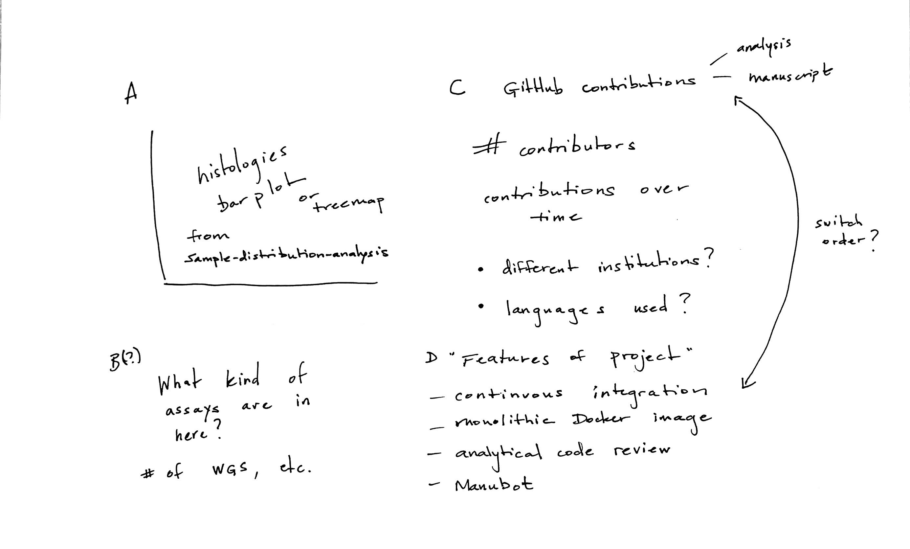

## Results

Results section stub.

### The Open Pediatric Brain Tumor Atlas

This section will introduce the dataset (e.g., the histologies represented and what data types are included; Figure {@fig:openpbta-overview}A-B) and the process for contributing analytical code and to the manuscript (Figure {@fig:openpbta-overview}C-D).

{#fig:openpbta-overview}

The oncoprint will provide a visualization of the genomic alterations found in the analyses implemented throughout the OpenPBTA project.
{#fig:oncoprint-landscape}