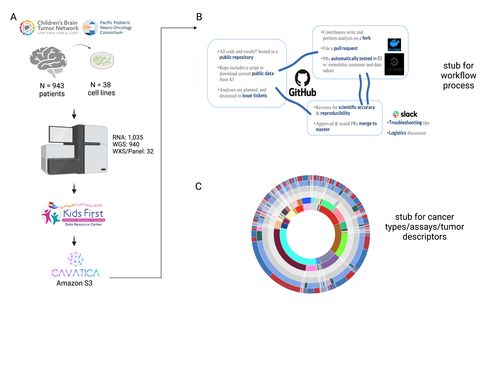

## Results

Results section stub.

### Crowd-sourced Somatic Analysis to create an Open Pediatric Brain Tumor Atlas

We previously performed whole genome sequencing (WGS), whole exome sequencing (WXS), and RNA sequencing (RNA-Seq) on matched tumor and normal tissues as well as selected cell lines from 943 patient tumors from the Pediatric Brain Tumor Atlas (PBTA) [@doi:10.1093/neuonc/noz192], samples sourced from the Children’s Brain Tumor Network (CBTN) and the PNOC003 DMG clinical trial [@doi:10.1002/ijc.32258] of the Pacific Pediatric Neuro-oncology Symposium (PNOC) (**Figure 1** {@fig:Fig1}). 
We then harnessed the benchmarking efforts of the KidsFirst Data Resource Center to develop a robust and reproducible data analysis workflow within the CAVATICA platform to perform primary somatic analyses: variant calling of single nucleotide variants (SNVs), copy number variants (CNVs), structural variants (SVs), and fusions (**Figure {@fig:FigS1}S1** - red boxes and **STAR Methods**). 
Next, we created a Github analysis repository (https://github.com/AlexsLemonade/OpenPBTA-analysis) with continuous integration to ensure analysis reproducibility and a GitHub manuscript repository (https://github.com/AlexsLemonade/OpenPBTA-manuscript) with ManuBot [@https://manubot.org/ ; @doi:10.1371/journal.pcbi.1007128] integration to enable manuscript creation using Markdown within GitHub. 
We maintained a data release folder on Amazon S3 containing merged files for each analysis, downloadable from the GitHub repository or open access CAVATICA project.  

Stub for the process for contributing analytical code (**Figure {@fig:FigS1}S1** and **STAR Methods**) and to the manuscript

{#fig:Fig1}

### Somatic Mutational Landscape of Pediatric Brain Tumors

We  performed a comprehensive genomic analysis of somatic SNVs, CNVs, SVs, and fusions across 1,969 tumors (N = 1,019 RNA-Seq, N = 1,719 WGS, N = 64 WXS/Panel) and 38 cell lines (N = 16 RNA-Seq, N = 22 WGS) from 943 patients.

#### Low-grade astrocytic tumors

*Figure {@fig:Fig2}2A* depicts an oncoprint of driver genes for 227 primary low-grade astrocytic tumors. As expected, the majority (62%, X/227) of these tumors harbor a somatic alteration in _BRAF_, with canonical _BRAF::KIAA1549_ fusions as the major oncogenic driver. 
We observed additional mutations in _FGFR1_ (2%), _PIK3CA_ (2%), _KRAS_ (2%), _TP53_ (1%), and _ATRX_ (1%) and fusions in _NTRK2_ (2%), _RAF1_ (2%), _MYB_ (1%), _QKI_ (1%), _ROS1_ (1%), and _FGFR2_ (1%), concordant with previous studies highlighting the near universal upregulation of the RAS/MAPK pathway in these tumors [@doi:10.1186/s40478-020-00902-z; @doi:10.1016/j.ccell.2020.03.011]. 
Indeed, we observed significant upregulation (ANOVA p < 0.01) of the KRAS signaling pathway in LGATs (*Figure {@fig:Fig4}4B).

#### Embryonal tumors (N = 131)
*Figure {@fig:Fig2}2B* depicts the oncoprint for 131 primary embryonal tumors within the OpenPBTA. 
The majority (N = 97) are medulloblastomas and span the spectrum of molecular subtypes: WNT, SHH, Group3, and Group 4 (see *Molecular Subtyping of CNS Tumors*) as well as mutational landscape. 
We detected canonical _SMARCB1/SMARCA4_ deletions or inactivating mutations in atypical teratoid rhabdoid tumors (ATRTs) and C19MC amplification in the embryonal tumors with multilayer rosettes (ETMRs) [@doi:10.1007/s00401-020-02182-2; @doi:10.1093/neuonc/noab178; @doi:10.1186/s40478-020-00984-9; @doi:10.1038/nature22973].

#### Diffuse astrocytic and oligodendroglial tumors
In *Figure {@fig:Fig2}2C*, we show an oncoprint for diffuse midline gliomas (DMGs, N = 34) and non-midline high-grade gliomas (N = 29) biopsied at diagnosis. The single oligodendroglioma sample in the OpenPBTA does not contain mutations in the genes shown and is therefore not present in this oncoprint. 
We found _TP53_ (57%, X/64) and _H3F3A_ (52%, X/64) to be the most mutated and co-occurring genes (*Figure {@fig:Fig2}3A*), followed by frequent mutations in _ATRX_ (30% N/64). 
We found recurrent amplifications and fusions in _EGFR_, _MET_, _PDGFRA_, and _KIT_, highlighting that these tumors utilize multiple oncogenic mechanisms to activate tyrosine kinases, as has been previously reported [@doi:10.1007/s12254-021-00680-x; @doi:10.1002/ijc.32258; @doi:10.1016/j.ccell.2017.08.017; @doi:10.1186/s40478-020-00905-w]. 
The two tumors with ultra-high tumor mutation burden (TMB) (> 100 Mutations/Mb) were from patients with known mismatch repair deficiency syndrome [@doi:10.1093/neuonc/noz192].
Gene set enrichment analysis showed upregulation (ANOVA p < 0.01) of DNA repair, G2M checkpoint, and MYC pathways as well as downregulation of the TP53 pathway (*Figure {@fig:Fig2}4B*).

#### Other CNS tumors (N = 199)
*Figure {@fig:Fig2}2D* depicts an oncoprint for the remaining primary CNS tumors within OpenPBTA. 
We observed 8% (X/131) of tumors to be C11orf95::RELA fusion positive ependymomas and 12% (X/131) to be adamantinomatous craniopharayngiomas driven by mutations in _CTNNB1_. 
Multiple cancer types contained somatic mutations or fusions in _NF2_ (7%, comprised of ependymomas, desmoplastic infantile astrocytoma and ganglioglioma, …, and …) and _BRAF_ (4%), in addition to rare ependymoma fusions (< 4% of all embryonal tumors) in _YAP1_, _KRAS_, _ERBB4_, and _MYB_. 
The majority of dysembryoplastic tumors harbored alterations in _FGFR1_, including _FGFR1::TACC1_ fusions [@doi:10.1007/s00401-016-1539-z; @doi:10.1038/s41525-017-0014-7; @doi:10.3171/2019.8.JNS191266; @doi:10.1007/s11060-020-03509-5; @doi:10.1016/j.jaad.2017.05.059; @doi:10.1016/j.ccell.2015.04.002; @doi:10.1186/s40478-020-01056-8; @doi:10.1007/s00381-017-3481-3].

![*Figure 2. Mutational landscape of PBTA tumors.*
Shown are frequencies of canonical somatic gene mutations, CNVs, fusions, and TMB (top barplot) for the top 20 genes mutated across primary tumors within the OpenPBTA dataset. A, Low-grade astrocytic tumors (N = 227): Low-grade glioma astrocytoma (N = 187), ganglioglioma (N = 35), Subependymal Giant Cell Astrocytoma (N = 2), diffuse fibrillary astrocytoma (N = 1), pilocytic astrocytoma (N = 1), and pleomorphic xanthoastrocytoma (N = 1); B, Embryonal tumors (N = 131): medulloblastomas (N = 97), atypical teratoid rhabdoid tumors (N = 24), embryonal tumors with multilayer rosettes (N = 2), other CNS embryonal tumors (N = 6), ganglioneuroblastoma (N = 1), and CNS neuroblastoma (N = 1); C, Diffuse astrocytic and oligodendrogliomal tumors (N = 64): diffuse midline gliomas (N = 34) and non-midline high-grade gliomas (N = 29); D, Other CNS tumors (N = 199): ependymomal tumors (N = 60), tumors of sellar region (N = 30), neuronal and mixed neuronal-glial tumor (GNT, N = 27), tumors of cranial and paraspinal nerves (N = 20), meningiomas (N = 17), mesenchymal non-meningothelial tumor (N = 16), germ cell tumors (N = 8), histiocytic tumors (N = 7), choroid plexus tumors (N = 4), tumors of pineal region (N = 4), metastatic tumors (N = 3), lymphoma (N = 1), melanocytic tumor (N = 1), and other (N = 1).
Patient sex (`germline_sex_estimate`) and tumor histology (`cancer_group`) are displayed as annotations at the bottom of each plot.
Only samples with mutations in the listed genes are shown.](https://github.com/AlexsLemonade/OpenPBTA-analysis/blob/master/figures/pngs/primary_only_oncoprint_landscape.png){#fig:Fig2}

### Landscape of Mutational Processes

This section summarizes the mutational landscape of the pediatric brain tumor samples of this dataset.
Figure {@fig:openpbta-overview}A shows the tumor mutation burden as compared to adult TCGA brain-related tumors.
Figure {@fig:mutational-landscape-overview}B-C show concordance of these samples with mutational signatures from COSMIC [@url:https://cancer.sanger.ac.uk/cosmic] and Alexandrov et al, 2013 [@doi:10.1038/nature12477] signature sets.

{#fig:mutational-landscape-overview}

### Copy Number Variant Overview

{#fig:copy-number-status-heatmap width="7in"}

### Recurrence and co-occurrence of mutations

This section will discuss the genes and regions that are repeatedly mutated within and between cancer types.
The occurrence of mutations in affecting particular genes, separated by tumor type is shown in Figure {@fig:occurrence-plots}A, with significant co-occurrence across all types illustrated in Figure {@fig:occurrence-plots}B.

![Occurrence and co-occurrence of nonsynonymous mutations for the 50 most commonly mutated genes across all tumor types.
A) Counts of nonsynonymous mutations, colored by tumor type (as defined in `integrated_diagnosis`).
B) Co-occurrence and mutual exclusivity of nonsynonymous mutations between genes.
The co-occurrence score is defined as $I(-\log_{10}(P))$ where $P$ is defined by Fisher's exact test and $I$ is 1 when mutations co-occur more often than expected and -1 when exclusivity is more common.
](https://github.com/AlexsLemonade/OpenPBTA-analysis/raw/master/figures/pngs/mutation_cooccurrence_figure.png){#fig:occurrence-plots}

### Transcriptomic landscape

This section will discuss the overall structure of the transcriptome data, pathway analysis, and immune deconvolution.
A dimension reduction plot, a heatmap of GSVA scores [@doi:10.1186/1471-2105-14-7], and a heatmap of xCell fraction values [@doi:10.1186/s13059-017-1349-1] are shown in Figure {@fig:transcriptomic-overview}.

{#fig:transcriptomic-overview}

### Quantify Telomerase Activity using Gene Expression Data

We used gene expression data sets from both poly-A and stranded RNA-Seq protocols to predict telomerase activities using EXTEND [@doi:10.1101/2020.05.21.109249] as shown in [Supplementary Tables](https://github.com/AlexsLemonade/OpenPBTA-analysis/tree/master/analyses/telomerase-activity-prediction/results).

For both platforms, EXTEND scores were highly consistent between FPKM versus counts data (Supplementary Figure) {@fig:comparison-plots}A and Figure {@fig:comparison-plots}B.
  
{#fig:comparison-plots}

We next examined telomerase activity across different brain tumor histological subtypes using data from the stranded FPKM protocol. 
Across the short histological groups, we found germinomas had the highest EXTEND scores. 
However, teratomas, another type of germ cell tumor, had much lower scores (Figure) {@fig:distribution-plots}A.
Teratomas were previously reported to have negligible or low telomerase activities [@doi:10.1093/jnci/91.15.1321]. 
Teratomas originating from the tissue of three dermal layers of an embryo, are benign germ cell neoplasms [@doi: 10.1097/MOP.0b013e32832b41ee].
These tumors are divided into mature and immature (malignant) groups, where pediatric tumors are mostly classified as mature ones [@doi: 10.1016/j.jpedsurg.2004.03.045]. 
Mature tumors are deficient of malignant potential thereby reducing the risk of malignancy [@doi: 10.1016/j.jpedsurg.2004.03.045], hence bearing low telomerase activities.
Benign neoplasia including dysplasia and hemangioblastomas had the lowest scores. 
Among common pediatric brain tumors, medulloblastomas had higher scores than high grade astrocytic tumors, ependymomas and low-grade astrocytomas. 
Across broad groups, benign tumors and precancerous lesions were among those with the lowest scores, whereas pineal region and embryonal tumors have the highest scores (Figure) {@fig:distribution-plots}B. 
Considering medulloblastoma tumors, high risk Group3 and Group4 subtypes had higher scores than WNT and SHH subtype (Figure) {@fig:distribution-plots}C. 
A similar pattern has been speculated with respect to cell of origin by one of the earlier studies [@doi:10.1007/s00401-013-1198-2] which mainly focused TERT promoter mutations for medulloblastoma subtypes comparisons rather than telomerase activity.

{#fig:distribution-plots}
