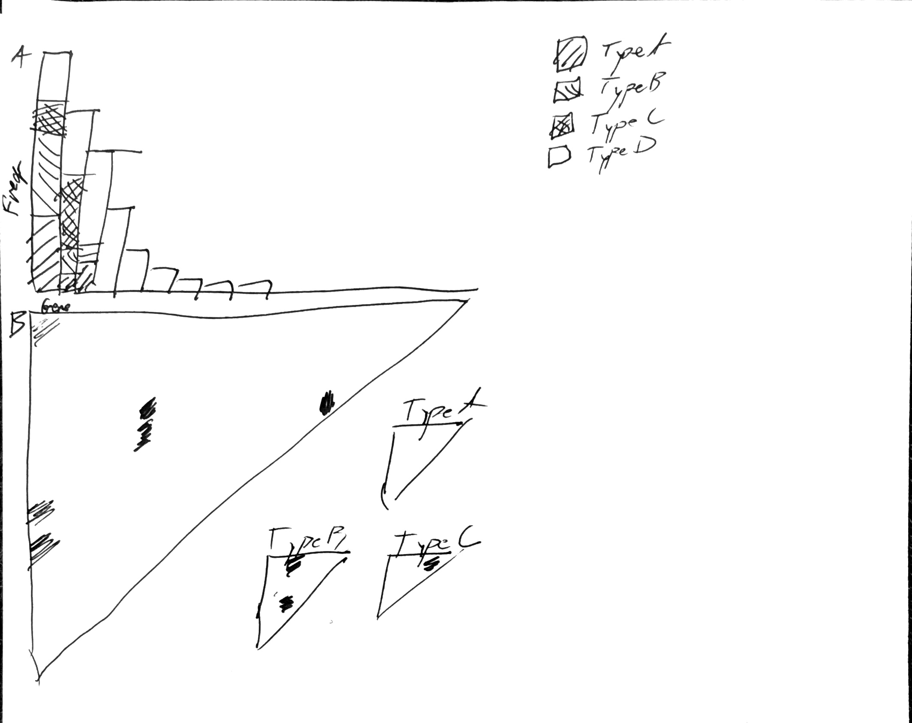

## Results

Results section stub.

### The Open Pediatric Brain Tumor Atlas

This section will introduce the dataset (e.g., the histologies represented and what data types are included; Figure {@fig:openpbta-overview}A-B) and the process for contributing analytical code and to the manuscript (Figure {@fig:openpbta-overview}C-D).

{#fig:openpbta-overview}

The oncoprint will provide a visualization of the genomic alterations found in the analyses implemented throughout the OpenPBTA project.
{#fig:oncoprint-landscape}

### Mutational Landscape

This section summarizes the mutational landscape of the pediatric brain tumor samples of this dataset.
Figure {@fig:openpbta-overview}A shows the tumor mutation burden as compared to adult TCGA brain-related tumors.
Figure {@fig:mutational-landscape-overview}B-C show concordance of these samples with mutational signatures from COSMIC [@url:https://cancer.sanger.ac.uk/cosmic] and Alexandrov et al, 2013 [@doi:10.1038/nature12477] signature sets.

{#fig:mutational-landscape-overview}

### Recurrence and co-occurrence of mutations

This section will discuss the genes and regions that are repeatedly mutated within and between cancer types.
The occurrence of mutations in affecting particular genes, separated by cancer,  type is shown in Figure {@fig:occurrence-plots}A, with significant co-occurrence across all types and within types with sufficient sample sizes illustrated in Figure {@fig:occurrence-plots}B.

{#fig:occurrence-plots}
