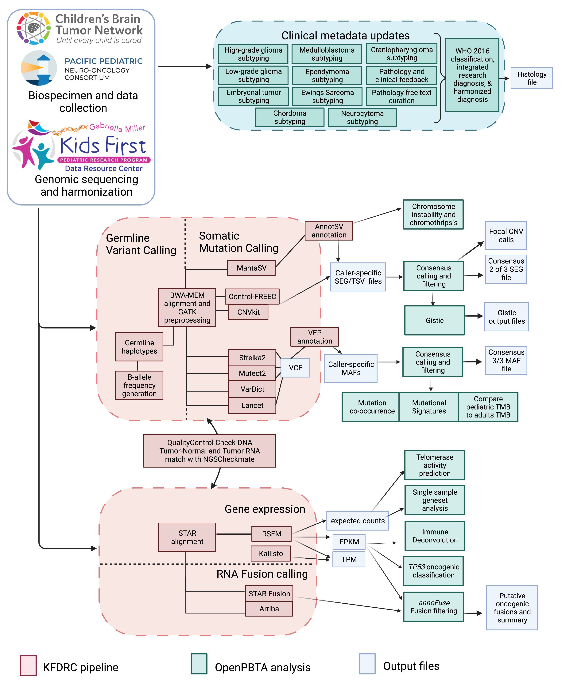

## Supplemental Information Titles and Legends
<!-- TODO: Add legends, update S4 if we keep immune deconv figures. -->

{#fig:FigS1}

{#fig:FigS2}

{#fig:FigS3}

{#fig:FigS4}

![**Figure S5. Related to Figure 4**.** First two dimensions from UMAP of sample transcriptome data with points colored by `molecular_subtype` for A, medulloblastoma, B, ependymoma, C, low-grade glioma, and D, high-grade diffuse astrocytic tumors. E, Receiver Operating Characteristic for _TP53_ classifier run on FPKM of poly-A RNA-Seq samples. F, Violin and box plots of _TP53_ scores plotted by _TP53_ alteration type in poly-A RNA-Seq samples. Correlation plots for telomerase scores (EXTEND) versus RNA expression of _TERT_ (G) and _TERC_ (H).](images/supplement/Figure-S5.png){#fig:FigS5}