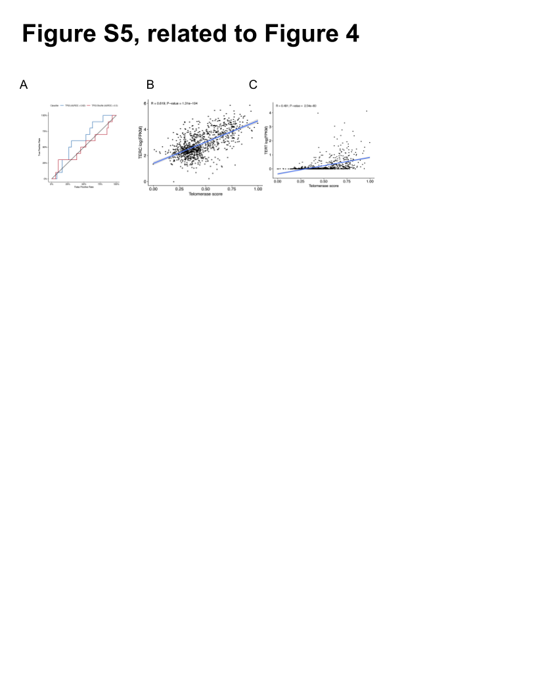

## Supplemental Information Titles and Legends
<!-- TODO: Add legends, update S4 if we keep immune deconv figures. -->

{#fig:FigS1}

{#fig:FigS2}

![**Figure S3. Genomic instability of pediatric brain tumors, Related to Figures 2 and 3.** A, Oncoprint of canonical somatic gene mutations, CNVs, fusions, and TMB (top bar plot) for the top 20 genes mutated across rare CNS tumors (N < 5 each): desmoplastic infantile astrocytoma and ganglioglioma (N = 1), germinoma (N = 4), glial-neuronal NOS (N = 4), metastatic secondary tumors (N = 3), neurocytoma (N = 2), and pineoblastoma (N = 3). Patient sex (`germline_sex_estimate`) and tumor histology (`cancer_group`) are displayed as annotations at the bottom of each plot. Only samples with mutations in the listed genes are shown. Multiple CNVs are denoted as a complex event. B, C, ](images/supplement/Figure-S3.png){#fig:FigS3}

{#fig:FigS4}

{#fig:FigS5}
