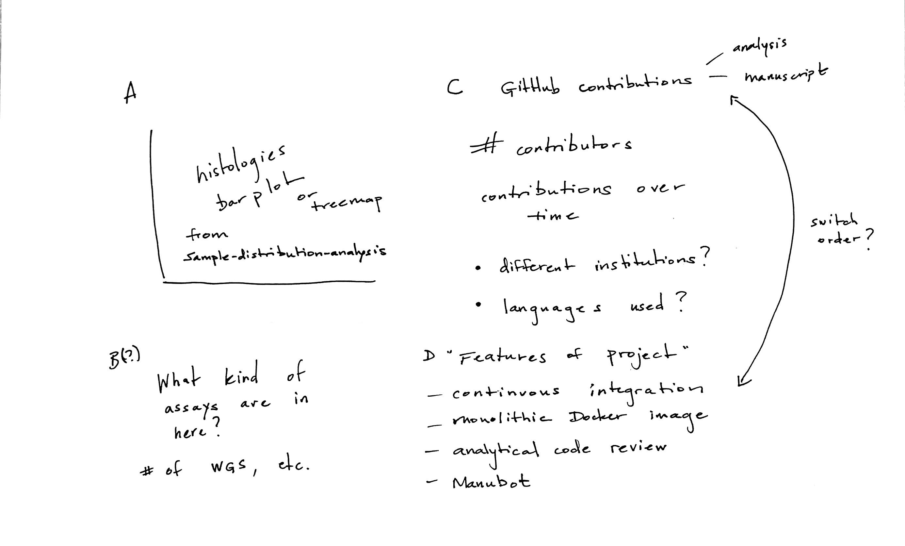
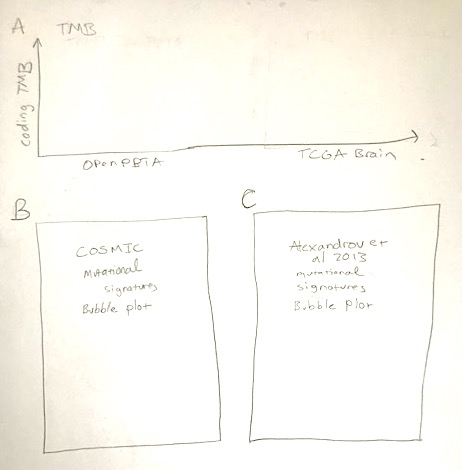

---
author-meta:
- John Doe
- Jane Roe
date-meta: '2020-02-28'
keywords:
- pediatric cancer
- brain tumor
- tumor atlas
lang: en-US
title: An Open Pediatric Brain Tumor Atlas
...

<small><em>
This manuscript
([permalink](https://AlexsLemonade.github.io/OpenPBTA-manuscript/v/fb8dff748117896f7bedda1f460d9161a9fff045/))
was automatically generated
from [AlexsLemonade/OpenPBTA-manuscript@fb8dff7](https://github.com/AlexsLemonade/OpenPBTA-manuscript/tree/fb8dff748117896f7bedda1f460d9161a9fff045)
on February 28, 2020.
</em></small>

## Authors

+ **John Doe** 
    {.inline_icon}
    [XXXX-XXXX-XXXX-XXXX](https://orcid.org/XXXX-XXXX-XXXX-XXXX)
    · {.inline_icon}
    [johndoe](https://github.com/johndoe)
    · {.inline_icon}
    [johndoe](https://twitter.com/johndoe) 
  <small>
     Department of Something, University of Whatever
     · Funded by Grant XXXXXXXX
  </small>

+ **Jane Roe** 
    {.inline_icon}
    [XXXX-XXXX-XXXX-XXXX](https://orcid.org/XXXX-XXXX-XXXX-XXXX)
    · {.inline_icon}
    [janeroe](https://github.com/janeroe) 
  <small>
     Department of Something, University of Whatever; Department of Whatever, University of Something
  </small>

## Abstract {.page_break_before}

## Introduction

Introduction will go here.

## Materials and Methods

### Biospecimen collection

The Pediatric Brain Tumor Atlas specimens are comprised of samples from Children's Brain Tumor Tissue Consortium (CBTTC) and the Pediatric Pacific Neuro-oncology Consortium (PNOC).

#### Children's Brain Tumor Tissue Consortium (CBTTC)

The CBTTC [@ME49zC7J] is a collaborative, multi-institutional (16 institutions worldwide) research program dedicated to the study of childhood brain tumors.
All CBTTC data can be download from the Gabriella Miller Kids First Data Resource Center (KF-DRC), [@JkpD6jMa].
The deidentified patient's blood and tumor tissue were prospectively collected by the consortium from patients enrolled within the CBTTC.

The cell lines were generated by the CBTTC from either fresh tumor tissue obtained directly from surgery performed at Children’s Hospital of Philadelphia (CHOP) or from prospectively collected tumor specimens stored in Recover Cell Culture Freezing media (cat# 12648010, Gibco).
The tissue was dissociated using enzymatic method with papain as described [@v08ocfr0].
Briefly, tissue was washed with HBSS (cat# 14175095, Gibco), minced and icubated with activated papin solution (cat# LS003124, SciQuest) for up to 45 minutes.
The papain was inactivated using ovomucoid solution (cat# 542000, SciQuest), tissue was briefly treated with DNase (cat#  10104159001, Sigma) and passed through the 100μm cell strainer (cat# 542000, Greiner Bio-One).
Two cell culture conditions were initiated based on the number of cells available.
For cultures utilizing the fetal bovine serum (FBS), a minimum density of 3×10^5 cells/ml were plated in DMEM/F-12 medium (cat# D8062, Sigma) supplemented with 20% FBS (cat# SH30910.03, Hyclone), 1% GlutaMAX (cat# 35050061, Gibco), Penicillin/Streptomycin-Amphotericin B Mixture (cat# 17-745E, Lonza) and 0.2% Normocin (cat# ant-nr-2, Invivogen).
For the serum-free media conditions cells were plated at minimum density of 1×10^6 cells/ml in DMEM/F12 media supplemented with 1% GlutaMAX, 1x B-27 supplement minus vitamin A (cat# 12587-010, Gibco), 1x N-2 supplement (cat# 17502001, Gibco), 20 ng/ml epidermal growth factor (cat# PHG0311L, Gibco), 20 ng/ml basic fibroblast growth factor (cat# 100-18B, PeproTech), 2.5μg/ml heparin (cat# H3149, Sigma), Penicillin/Streptomycin-Amphotericin B Mixture and 0.2% Normocin.

#### Pacific Pediatric Neuro Onclology Consortium (PNOC)

The Pacific Pediatric Neuro-Oncology Consortium (PNOC) is an international consortium dedicated to bringing new therapies to children and young adults with brain tumors.
PNOC collected blood and tumor biospecimens from newly-diagnosed DIPG patients as part of the clinical trial [PNOC003/NCT02274987](https://clinicaltrials.gov/ct2/show/NCT02274987) [@BLNV1DbL].

### Nucleic acids extraction and library preparation

#### PNOC samples
The Translational Genomic Research Institute (TGEN; Phoenix, AZ) performed DNA and RNA extractions on tumor biopsies using a DNA/RNA AllPrep Kit (Qiagen, #80204).
All RNA used for library prep had a minimum RIN of 7 but no QC thresholds were implemented for the DNA.
For library preparation, 500ng of nucleic acids were used as input for RNA-Seq, WXS, and targeted DNA panel (panel).
The RNA prep was performed using the TruSeq RNA Sample Prep Kit (Illumina, #FC-122-1001) and the exome prep was performed using KAPA Library Preparation Kit (Kapa Biosystems, #KK8201) using Agilent's SureSelect Human All Exon V5 backbone with custom probes.
The targeted DNA panel developed by Ashion (formerly known as the GEM Cancer panel) consisted of exonic probes against 541 cancer genes.
Both panel and WXS assays contained 44,000 probes across evenly spaced genomic loci used for genome-wide copy number analysis.
For the panel, additional probes tiled across intronic regions of 22 known tumor suppressor genes and 22 genes involved in common cancer translocations for structural analysis.
All extractions and library preparations were performed according to manufacturer's instructions.

#### CBTTC samples

Blood, tissue, and cell line DNA/RNA extractions were performed at Biorepository Core (BioRC) at CHOP.
Briefly, 10-20 mg frozen tissue, 0.4-1ml of blood or 2×10^6 cells pellet was used for extractions.
Tissues were lysed using a Qiagen TissueLyser II (Qiagen) with 2×30 sec at 18Hz settings using 5 mm steel beads (cat# 69989, Qiagen).
Both tissue and cell pellets processes included a CHCl3 extraction and were run on the QiaCube automated platform (Qiagen) using the AllPrep DNA/RNA/miRNA Universal kit (cat# 80224, Qiagen).
Blood was thawed and treated with RNase A (cat#, 19101, Qiagen); 0.4-1ml was processed using the Qiagen QIAsymphony automated platform (Qiagen) using the QIAsymphony DSP DNA Midi Kit (cat# 937255, Qiagen).
DNA and RNA quantity and quality was assessed by PerkinElmer DropletQuant UV-VIS spectrophotometer (PerkinElmer) and an Agilent 4200 TapeStation (Agilent, USA) for RINe and DINe (RNA Integrity Number equivalent and DNA Integrity Number equivalent respectively).
Library preparation and sequencing was performed by the NantHealth sequencing center.
Briefly, DNA sequencing libraries were prepared for tumor and matched-normal DNA using the KAPA Hyper prep kit (cat# KK8541, Roche); tumor RNA-Seq libraries were prepared using KAPA Stranded RNA-Seq with RiboErase kit (cat# KK8484, Roche).
Whole genome sequencing (WGS) was performed at an average depth of coverage of 60X for tumor samples and 30X for germline.
The panel tumor sample was sequenced to 470X and the normal panel sample was sequenced to 308X.
RNA samples were sequenced to an average of 200M reads.
All samples were sequenced on the Illumina HiSeq platform (X/400) (Illumina) with 2 × 150bp read length.

#### Data generation

NantHealth Sequencing Center (Culver City, CA) performed whole genome sequencing (WGS) on all paired tumor (~60X) and constitutive (~30X) DNA samples.
WGS libraries were 2x150 bp and sequenced on an Illumina X/400.
NantHealth Sequencing Center performed ribosomal-depleted whole transcriptome stranded RNA-Seq to an average depth of 100M reads for CBTTC tumor samples.
The Translational Genomic Research Institute (TGEN; Phoenix, AZ) performed paired tumor (~200X) and constitutive whole exome sequencing (WXS) or targeted DNA panel (panel) and poly-A selected RNA-Seq (~200M reads) for  PNOC tumor samples.
PNOC WXS and RNA-Seq libraries 2x100 bp and sequenced on an Illumina HiSeq 2500.

### DNA WGS Alignment

We used BWA-MEM [@gmH6YDca] v0.7.17 for alignment of paired-end DNA-seq reads.
The alignment reference that we used was Homo Sapiens Human Genome (hg) version 38, patch release 12, fasta file obtained from UCSC [@1AWRgvxVu].
Alignments were further processed using following the Broad Institute's Best Practices [@EHMzG34o=11165] for processing BAMs in preparation for variant discovery.
Duplicates were marked using Samblaster[@IzUbOv92] v0.1.24, BAMs merged and sorted using Sambamba [@PcJwlZj3] v0.6.3.
Lastly, resultant BAMs were processing using Broad's Genome Analysis Tool Kit (GATK) [@RsmkaFIb] v4.0.3.0, BaseRecalibrator submodule.

### Quality Control of Sequencing Data

NGSCheckmate [@A4FXW005] was performed on matched tumor/normal CRAMs to confirm sample matches and remove mis-matched samples from the dataset.
CRAM inputs were preprocessed using bcftools to filter and call 20k common SNPs using default parameters[@16tUBMk59] and the resulting VCFs were used to run NGSCheckmate using [this workflow](https://github.com/d3b-center/ngs_checkmate_wf) in the D3b GitHub repository.
Per author guidelines, <= 0.61 was used as a correlation coefficient cutoff at sequencing depths >10 to predict mismatched samples.
For RNA-Seq, read strandedness was determined by running the [`infer_experiment.py` script](http://rseqc.sourceforge.net/#infer-experiment-py) on the first 200k mapped reads.
If calculated strandedness did not match strandedness information received from the sequencing center, samples were removed from analysis.
We required at least 60% of RNA-Seq reads mapped to the human reference or samples were removed from analysis.

### Germline Variant Calling
#### SNV calling for B-allele Frequency (BAF) generation
Germline haplotype calls were performed following the [GATK Joint Genotyping Workflow](https://software.broadinstitute.org/gatk/best-practices/workflow?id=11145), except the workflow was run on an individual sample basis.
Using only SNPs, we applied the [GATK generic hard filter suggestions](https://gatkforums.broadinstitute.org/gatk/discussion/2806/howto-apply-hard-filters-to-a-call-set) to the VCF, with an additional requirement of 10 reads minimum depth per SNP.
This filtered VCF was used as input to ControlFreeC and CNVKit (below) for generation of BAF files.
GATK v4.0.12.0 was used for all steps except `VariantFiltration`, which used 3.8.0 because as of GATK 4.0.12.0, this tool was beta and known to be unreliable for this purpose.
This single-sample workflow can be found in the [Kids First GitHub repository](https://github.com/kids-first/kf-jointgenotyping-workflow).

### Somatic Mutation Calling
#### SNV and INDEL calling

We used four variant callers to call SNVs and INDELS from targeted DNA panel, WXS, and WGS data: Strelka2, Mutect2, Lancet, and VarDict.
The input interval BED files for both panel and WXS data provided by the manufacturers were padded by 100 bp on each side during all variant calling algorithm runs.
For WGS calling, we utilized the non-padded BROAD Institute interval calling list [`wgs_calling_regions.hg38.interval_list`](https://console.cloud.google.com/storage/browser/_details/genomics-public-data/resources/broad/hg38/v0/wgs_calling_regions.hg38.interval_list), comprised of the full genome minus N bases, unless otherwise noted below.
Strelka2 [@REfkDUtE] v2.9.3 was run using default parameters for canonical chromosomes (chr1-22, X,Y,M), as recommended by the authors.
The final Strelka2 VCF was filtered for PASS variants.
Mutect2 from GATK v4.1.1.0 was run following Broad best practices outlined from their Workflow Description Language (WDL) [@E5aTvXmQ].
The final Mutect2 VCF was filtered for PASS variants.
To manage memory issues, VarDictJava [@trQRR8fs] v1.58 [@1GMHnwH5p] was run using 20Kb interval chunks of the input BED, padded by 100 bp on each side, such that if an INDEL occurred in between intervals, it would be captured.
Parameters and filtering followed [BCBIO standards](https://github.com/bcbio/bcbio-nextgen) except that variants with a variant allele frequency (VAF) >= 0.05 (instead of >= 0.10) were retained.
The 0.05 VAF increased the true positive rate for INDELs and decreased the false positive rate for SNVs when using VarDict in consensus calling.
The final VCF was filtered for PASS variants with TYPE=StronglySomatic.
Lancet [@V6KdWVYi] v1.0.7 [@dYF6AyBo] was run using default parameters, unless noted below.
For input intervals to Lancet, a reference BED was created by using only the UTR, exome, and start/stop codon features of the GENCODE 31 reference, augmented as recommended with PASS variant calls from Strelka2 and Mutect2 [@bKthX7vJ].
These intervals were then padded by 300 bp on each side during Lancet variant calling.
Per recommendations by the New York Genome Center [@bKthX7vJ], the Lancet input intervals described above were augmented with PASS variant calls from Strelka2 and Mutect2 as validation.

#### VCF annotation and MAF creation

We filtered outputs from both callers on the "PASS" filter, and annotated using The ENSEMBL Variant Effect Predictor [@p1f5DxRQ], reference release 93, and created MAFs using MSKCC's vcf2maf [@11Fn5jqUI] v1.6.17.

#### Consensus SNV Calling

Our SNV calling process led to separate sets of predicted mutations for each caller.
We considered mutations to describe the same change if they were identical for the following MAF fields: `Chromosome`, `Start_Position`, `Reference_Allele`,  `Allele`, and `Tumor_Sample_Barcode`.
Strelka2 does not call multinucleotide variants (MNV), but instead calls each component SNV as a separate mutation, so we separated MNV calls from Mutect2 and Lancet into consecutive SNVs before comparing them with Strelka2.
We examined the variant allele frequencies produced by each caller and compared their overlap with each other [@Ob2wQ9wX].
VarDict calls included many variants that were not identified by other callers [@Z1i0sjNH], while the other callers produced results that were relatively consistent with one another.
Many of these VarDict-specific calls were variants with low allele frequency [@tkwfe0u6].
We termed mutations shared among the other three callers (Strelka2, Mutect2, and Lancet) to be consensus mutation calls and dropped VarDict due to concerns about it calling a large number of false positives.
In practice, because our filtered set was based on the intersection of these three sets and because VarDict called nearly every mutation from the other three callers plus many that were unique to it, the decision to not consider VarDict calls has little impact on the results.

For some downstream analyses, only coding sequence SNVs (based on GENCODE v27 [@9oRUnb2k]) are used, to enhance comparability to other studies.
We considered base pairs to be *effectively surveyed* if they were in the intersection of the genomic ranges considered by the callers used to generate the consensus and where appropriate, regions of interest, such as coding sequences.
This definition of *effectively surveyed* base pairs is what is used to calculate effective genome size for calculations for tumor mutation burden and mutational signatures.

### Somatic Copy Number Variant Calling

We used Control-FREEC [@ZQ0L3o1q; @1F3i4BvCt] v11.6 and CNVkit [@UTxRcYIQ] v0.9.3 for copy number variant calls.
For both algorithms, the `germline_sex_estimate` (described below) was used as input for sample sex and germline variant calls (above) were used as input for BAF estimation.
ControlFreeC was run on human genome reference hg38 using the optional parameters of a 0.05 coefficient of variation, ploidy choice of 2-4, and BAF adjustment for tumor-normal pairs.
Theta2 [@V4PckbrH] used VarDict germline and somatic calls, filtered on PASS and strongly somatic, to infer tumor purity.
Theta2 purity was added as an optional parameter to CNVkit to adjust copy number calls.
CNVkit was run on human genome reference hg38 using the optional parameters of Theta2 purity and BAF adjustment for tumor-normal pairs.

### Somatic Structural Variant Calling

We used Manta SV [@kTn1PIj5] v1.4.0 for structural variant (SV) calls.
Manta SV calling was also limited to regions used in Strelka2.
The hg38 reference for SV calling used was limited to canonical chromosome regions.
The somatic DNA workflow for SNV, INDEL, copy number, and SV calling can be found in the [KidsFirst Github repository](https://github.com/kids-first/kf-somatic-workflow).
Manta SV output was annotated using [AnnotSV v2.1](https://lbgi.fr/AnnotSV/) [@7Ull5aU5] and the workflow can be found in the [D3b GitHub repository](https://github.com/d3b-center/annotSV/tree/master).

### Gene Expression Abundance Estimation

We used STAR [@tTu8Ds9Z] v2.6.1d to align paired-end RNA-seq reads.
This output was used for all subsequent RNA analysis. The reference we used was that of ENSEMBL's GENCODE 27 [@9oRUnb2k], "Comprehensive gene annotation."
We used RSEM [@Dh2n1EV3] v1.3.1 for both FPKM and TPM transcript- and gene-level quantification.
We also added a second method of quantification using kallisto [@12KZMHMQl] v0.43.1.
This method differs in that it uses pseudoaligments using fastq reads directly to the aforementioned GENCODE 27 reference.

### Gene Expression Matrices with Unique HUGO Symbols
Algorithms that perform gene set enrichment, molecular subtyping, or immune-profiling, for example, require an RNA-seq gene expression matrix as input, with HUGO gene symbols as row names and sample names as column names.
This is not straight-forward, as there are a small proportion of gene symbols that map to multiple Ensembl gene identifiers (in Gencode v27, 212 gene symbols map to 1866 Ensembl gene identifiers).

We first removed genes with no expression using a cut-off of FPKM > 0 in at least 1 sample across the PBTA cohort. Next, of the expressed multi-mapped genes, we found 168 genes mapped to 1393 Ensembl gene identifiers in the stranded dataset and 139 genes mapped to 429 Ensembl gene identifiers in the polyA dataset.
Of these, only a small proportion were found to be protein coding genes, i.e. 3% (42/1393) in stranded and 10% (42/429) in the poly-A dataset.
The top two most represented gene biotypes were misc_RNA (60% for stranded; 36% for poly-A) and snoRNA (24% for stranded and 27% for poly-A).

We computed the mean FPKM across all samples per gene and for each multi-mapped gene symbol, we chose the Ensembl identifier corresponding to the maximum mean FPKM with the goal of choosing the identifier that best represented the expression of the gene.
After collapsing gene identifiers, there were a total of 46,400 unique expressed genes in the poly-A dataset and a total of 53,011 unique expressed genes remaining in the stranded dataset.

For each multi-mapped gene symbol, we also performed a correlation analysis between the duplicated genes so see how well the expression between different Ensembl identifiers of the same gene correlated.
We computed the average Pearson correlation coefficient between the expressed gene identifier that was kept (after collapsing) vs each expressed gene identifier that was discarded.
We did not find any striking patterns of correlations and the correlation coefficients were quite arbitrary  as high as 0.92 and 1.00 and as low as -0.27 and -0.19 in stranded and polyA dataset, respectively.

### Immune Profiling/Deconvolution
In general, immune deconvolution from the tumor microenvironment is complicated in that most deconvolution methods do not always agree because of the type of underlying algorithm, the ability to deconvolute certain cell types better than others and the type of output: some methods output actual cell fractions while others output scores that correlate to cell abundance.

We used the R package immunedeconv [@1Ac8JWQ8h; @klaJnG8x] to deconvolute, quantify and compare various immune cell types across 21 histologies from the PBTA cohort (stranded and polyA).
The package provides a unified interface for cell type quantification from RNA-seq gene expression data using multiple methods: EPIC (immune cells, fibroblasts, endothelial cells; n = 6), TIMER (immune cells; n = 6), MCP-counter (immune cells, fibroblasts, endothelial cells; n = 8), quanTIseq (immune cells; n = 10), CIBERSORT (immune cells; n = 22) and xCell (immune and non-immune cells; n = 64).
To get a more fine grained deconvolution, we chose the top two most comprehensive methods i.e. xCell and CIBERSORT that are able to deconvolute 64 and 22 cell types, respectively.
xCell tests for enrichment of cell types using ssGSEA and CIBERSORT uses ν-Support Vector Regression.
xCell was our method of choice because 1) it is able to deconvolute the maximum number of immune and non-immune cell types, 2) is highly robust against background predictions and 3) can reliably identify the presence of immune cells at low abundances (0-1% infiltration depending on the immune cell type) [@1Ac8JWQ8h].
Further, xCell was also shown to robustly outperform all other methods, including CIBERSORT in a benchmarking study [@jvorcKyN].
We chose CIBERSORT as the second method because like xCell, it represents immune cell content as arbitrary scores that are highly correlated with actual cell proportions and are cross comparable between the two methods.
The advantage of these methods is that they allow between samples (inter-sample), between cell types (intra-sample) and between cancer type (inter-histology) comparisons.

To compare the outcome scores across the two profiling methods i.e. xCell and CIBERSORT, we took 13 cell types commonly represented between both methods and created a correlation plot per cell type per histology [@epfPgFJd(abs.).png].
Overall, across all histologies and cell types, the predictions did not correlate well (pearson correlation = 0.12) but we did observe a high correlation (> 0.5) between certain cell type predictions i.e. Macrophages M2, Monocytes, Neutrophils and T cell CD8+ markers across specific histologies.

In order to see histology specific enrichment of certain cell types, we created heatmaps for xCell [@Wb3s53Q7] and CIBERSORT [@iwZ4djxN(abs.).png] representing average immune cell scores normalized across histologies.
We observed a very similar and interesting pattern in the heatmaps as well i.e. cell types that were highly correlated between xCell and CIBERSORT are also the ones that are found in high proportions compared to other cell types.
Using the profiling methods, we could distinctively identify three histologies enriched in specific cell types: Histiocytic tumors (n = 5) which are known to be characterized by an increase in Monocytes, Macrophages and Dendritic cells [@ItUbSSvv] were observed to be enriched in Myeloid dendritic cell activated, Monocytes, Neutrophils and Macrophage M1/M2; Lymphomas (n = 1) were seen to be enriched in B cell plasma, Class-switched memory B cell, B cell naive, B cell, B cell memory, T cell regulatory (Tregs), Common Lymphoid progenitor [@ywns2iy3]; and Germ cell tumors (n = 13) as expected [@Gv11xzwL] were seen to be enriched in T cell CD8+ and T cell CD4+ naive cells.

Because we only have a sample size of 1 for Lymphomas, we couldn't get any correlation between immune scores of xCell and CIBERSORT across various B cell types but looking at the heatmap of average scores per cell type per histology, it is highly likely that given a larger sample size, the immune scores between the two methods would correlate.

### RNA Fusion Calling and Prioritization
#### Gene fusion detection

We set up [Arriba v1.1.0](https://github.com/suhrig/arriba/) and STAR-Fusion 1.5.0 [@rqYlIiAi] fusion detection tools using CWL on CAVATICA.
For both these tools we used aligned BAM and chimeric SAM files from STAR as inputs and GRCh38_gencode_v27 GTF for gene annotation.
We ran STAR-Fusion with default parameters and annotated all fusion calls with GRCh38_v27_CTAT_lib_Feb092018.plug-n-play.tar.gz provided in the STAR-fusion release.
For Arriba, we used a blacklist file (blacklist_hg38_GRCh38_2018-11-04.tsv.gz) from the Arriba release tarballs to remove recurrent fusion artifacts and transcripts present in healthy tissue.
We also provided Arriba with strandedness information or set it to auto-detection for polyA samples.
We used [FusionAnnotator](https://github.com/FusionAnnotator/FusionAnnotator) on Arriba fusion calls in order to harmonize annotations with those of STAR-Fusion.
The RNA expression and fusion workflows can be found in the [KidsFirst GitHub repository](https://github.com/kids-first/kf-rnaseq-workflow) and the FusionAnnotator workflow found in the [D3b GitHub repository](https://github.com/d3b-center/FusionAnnotator).

#### Fusion prioritization

We performed artifact filtering and additional annotation on fusion calls to prioritize putative oncogenic fusions.
Briefly, we considered all inframe and frameshift fusion calls with a minimum of 1 junction reads and at least one gene partner expressed (TPM > 1) to be true calls.
If a fusion call had large number of spanning fragment reads compared to junction reads (spanning fragment minus junction read greater than ten), we removed these calls as potential false positives.
We prioritized a union of fusion calls as true calls if the fused genes were detected by both callers, the same fusion was recurrent within a `broad_histology` (>2 samples) or the fusion was specific to the `broad_histology`.
If either 5' or 3' genes fused to more than five different genes within a sample, we removed these calls as potential false positives.
We annotated putative driver fusions and prioritized fusions based on partners containing known [kinases](http://kinase.com/human/kinome/tables/Kincat_Hsap.08.02.xls), [oncogenes](http://www.bushmanlab.org/assets/doc/allOnco_Feb2017.tsv), [tumor suppressors](https://bioinfo.uth.edu/TSGene/Human_TSGs.txt?csrt=5027697123997809089), curated transcription factors [@9vS8HBL6], [COSMIC genes](https://cancer.sanger.ac.uk/census), and/or known [TCGA fusions](https://tumorfusions.org/PanCanFusV2/downloads/pancanfus.txt.gz) from curated [references](https://github.com/AlexsLemonade/OpenPBTA-analysis/tree/master/analyses/fusion_filtering/references).
_MYBL1_ [@jLWV5IWB], _SNCAIP_ [@4wYR62jK], _FOXR2_ [@kfmK8vm], _TTYH1_ [@5ueZBnsJ], and _TERT_ [@ASmwGlFp; @YfG9EVSk; @lWMOs28t; @1B3tdZcAl] were added to the oncogene list and _BCOR_ [@kfmK8vm] and _QKI_ [@1foRpfch] were added to the tumor suppressor gene list based on pediatric cancer literature review.
The fusion filtering workflow can be found in the [OpenPBTA Analysis repository](https://github.com/AlexsLemonade/OpenPBTA-analysis/tree/master/analyses/fusion_filtering).

### Mutational Signatures

We obtained weights for signature sets by applying deconstructSigs [@KhxTOfIb ; @1eIeMT1A] to consensus SNVs with the BSgenome.Hsapiens.UCSC.hg38 annotations [@GpcQXpz9].
We estimated how many mutations contributed to each signature for each sample using each sample's signature weights.
Weights for signatures fall in the range zero to one inclusive.
For a given sample and signature combination, we estimated the number of contributing mutations per Mb of the genome by multiplying the signature weight by the total number of trinucleotide mutations identified by deconstructSigs and then dividing by the size of the effectively surveyed genome.  

$$ \frac{\textrm{# of contributing mutations}}{Mb} = \frac{\textrm{weight} * \sum{\textrm{# Trinucleotide mutations}}} {\textrm{Size in Mb of effectively surveyed genome}}
$$

These results do not include signatures with small contributions; deconstructSigs drops signature weights that are less than 6% [@KhxTOfIb].
We used these methods to calculate signature scores for each sample with both COSMIC [@m4IK7k7z] and Alexandrov et al, 2013 [@kG8qNLrs] signature sets.

### PBTA Tumor Mutation Burden

We consider tumor mutation burden (TMB) to be the number of consensus SNVs per *effectively surveyed* base of the genome.

$$ \textrm{TMB} = \frac{\textrm{\# of coding sequence SNVs}}{\textrm{Size in Mb of {\em effectively surveyed} genome}}
$$

We used the total number coding sequence consensus SNVs for the numerator and the size of the intersection of the regions considered by Lancet, Strelka2, and Mutect2 with coding regions (CDS from GENCODE v27 annotation [@9oRUnb2k]) as the denominator.

### TCGA Tumor Mutation Burden

We calculated tumor mutation burden in TCGA using MC3 mutation calls [@cDnF3a5Q] for TCGA brain-related tumor projects including: LGG (Lower-grade Glioma) [@ei4gGEBQ], GBM (Glioblastoma Multiforme) [@xm7TtQ4U], and PCPG (Pheochromocytoma and Paraganglioma) [@vIvggrJi].
The MC3 project provided an exome BED file.
All SNVs fell within these regions.
We considered the regions covered by the MC3 BED file (based on GENCODE v19 annotation [@ukGlPa3O]) to have been effectively surveyed.

### Clinical Data Harmonization

#### WHO Classification of Disease Types

The `disease_type_old` field in the `pbta-histologies.tsv` file contains the diagnosis denoted from the patient's pathology report.
The `disease_type_new` field in the `pbta-histologies.tsv` file includes updates to `disease_type_old` and these changes are documented in the `Notes`.
For instance, any diagnosis denoted as "Other" in `disease_type_old` was modified to capture the pathology report diagnosis in `disease_type_new`.
Additionally, `disease_type_old` was modified to `disease_type_new` if the presence of specific molecular alterations defined a biospecimen as having an alternate diagnosis.
The `broad_histology` denotes the broad 2016 WHO classification [doi:10.1007/s00401-016-1545-1] for each tumor.
The `short_histology` is an abbreviated version of the `broad_histology`.
The `glioma_brain_region` was subtyped into hemispheric, midline, mixed, or other based on specimen location (see table below).

| Metadata | Definition | Possible values |
|---------------------------|----------------------------------------------------------------------------------------------------------------------------|-----------------------------------------------------------------------------------------------------------------------------------------------------------------------------------------------------------------------|
| age_at_diagnosis_days | Patient age at diagnosis in days | numeric |
| age_last_update_days | Patient age at the last clinical event/update in days | numeric |
| aliquot_id | External aliquot identifier | variable |
| broad_composition | Broad classification of sample type | cell-line;cyst;non-tumor;tumor |
| broad_histology | Broad WHO 2016 classification of cancer type | text |
| cancer_predispositions | Reported cancer predisposition syndromes | text |
| cohort | Scientific cohort | CBTTC;PNOC |
| composition | Sample composition | Derived Cell Line;Not Reported;Peripheral Whole Blood;Saliva;Solid Tissue |
| disease_type_new | Updated and/or integrated molecular diagnosis | text |
| disease_type_old | Reported patient diagnosis from pathology reports | text |
| ethnicity | Patient reported ethnicity | text |
| experimental_strategy | Sequencing strategy | WGS;WXS;RNA-Seq;Panel |
| germline_sex_estimate | Predicted sex of patient based on germline X and Y ratio calculation (described in methods) | Female;Male;Unknown |
| glioma_brain_region | Brain region for all tumors classified as LGAT or HGAT | midline (Thalamus|Pons|Spinal Cord|Brain Stem|Midbrain|Hippocampus|Medulla);hemispheric (Lobe|Cerebellum); mixed (mixture of midline and hemispheric regions);other(optic pathway|pituitary|hypothalamus|suprasellar) |
| Kids_First_Biospecimen_ID | KidsFirst Biopecimen identifier | BS_######## |
| Kids_First_Participant_ID | KidsFirst patient identifier | PT_######## |
| molecular_subtype | Molecular subtype defined by WHO 2016 guidelines | text |
| normal_fraction | Theta2 normal DNA fraction estimate | numeric |
| Notes | Free text field describing changes from diagnosis_old to diagnosis_new or manner in which molecular_subtype was determined | text |
| OS_days | Overall survival in days | numeric |
| OS_status | Overall survival status | DECEASED;LIVING |
| primary_site | Bodily site(s) from which specimen was derived | text |
| race | Patient reported race | text |
| reported_gender | Patient reported gender | text |
| RNA_library | Type of RNA-Sequencing library preparation | stranded;poly-A |
| sample_id | External biospecimen identifier | variable |
| sample_type | Broad sample type | Normal;Tumor |
| seq_center | Sequencing center | BGI@CHOP Genome Center;Genomic Clinical Core at Sidra Medical and Research Center;NantOmics;TGEN |
| short_histology | Abbreviated disease_type_new | text |
| tumor_descriptor | Phase of therapy from which tumor was derived | Initial CNS Tumor;Progressive Progressive Disease Post-Mortem;Recurrence;Second Malignancy;Unavailable |
| tumor_fraction | Theta2 tumor DNA fraction estimate | numeric |
| tumor_ploidy | ControlFreeC ploidy | numeric  |

Table S1. Clinical metadata collected for OpenPBTA. {#tbl:S1}

#### Molecular Subtyping

The `molecular_subtype` column in the `pbta-histologies.tsv` file contains molecular subtype information derived as described below.
Medulloblastoma subtypes SHH, MYC, Group 3, and Group 4 were predicted using an [RNA expression classifier](https://github.com/d3b-center/medullo-classifier-package) on the RSEM FPKM data.

#### Survival

Overall survival, denoted `OS_days`, was calculated as days since initial diagnosis.

#### Prediction of participants' genetic sex

The clinical metadata provided included a reported gender.
We used DNA data, in concert with the reported gender, to predict participant genetic sex so that we could identify sexually dimorphic outcomes.
This analysis could also reveal samples that may have been contaminated in certain circumstances.
We used the idxstats utility from SAMTOOLS [@hNfNHk9L] to calculate read lengths, the number of mapped reads, and the corresponding chromosomal location for reads to the X and Y chromosomes.
We used the fraction of total normalized X and Y chromosome reads that were attributed to the Y chromosome as a summary statistic.
We reviewed this statistic in the context of reported gender and determined that a threshold of less than 0.2 clearly delineated female samples.
Fractions greater than 0.4 were predicted to be males.
Samples with values in the range [0.2, 0.4] were marked as unknown.
We ran this analysis through [CWL](https://github.com/d3b-center/sex-determination-tool) on Cavatica.
Resulting calls were added to the clinical metadata as `germline_sex_estimate`.

#### Selection of independent samples

Certain analyses required that we select only a single representative specimen for each individual.
In these cases, we prioritized primary tumors and those with whole-genome sequencing available.
If this filtering still resulted in multiple specimens, we selected from the remaining set randomly.

## Results

Results section stub.

### The Open Pediatric Brain Tumor Atlas

This section will introduce the dataset (e.g., the histologies represented and what data types are included; Figure {@fig:openpbta-overview}A-B) and the process for contributing analytical code and to the manuscript (Figure {@fig:openpbta-overview}C-D).

{#fig:openpbta-overview}

### Landscape of Genomic Alterations

The oncoprint will provide a visualization of the genomic alterations found in the analyses implemented throughout the OpenPBTA project.

{#fig:oncoprint-landscape}

### Landscape of Mutational Processes

This section summarizes the mutational landscape of the pediatric brain tumor samples of this dataset.
Figure {@fig:openpbta-overview}A shows the tumor mutation burden as compared to adult TCGA brain-related tumors.
Figure {@fig:mutational-landscape-overview}B-C show concordance of these samples with mutational signatures from COSMIC [@m4IK7k7z] and Alexandrov et al, 2013 [@kG8qNLrs] signature sets.

{#fig:mutational-landscape-overview}

### Recurrence and co-occurrence of mutations

This section will discuss the genes and regions that are repeatedly mutated within and between cancer types.
The occurrence of mutations in affecting particular genes, separated by cancer,  type is shown in Figure {@fig:occurrence-plots}A, with significant co-occurrence across all types and within types with sufficient sample sizes illustrated in Figure {@fig:occurrence-plots}B.

{#fig:occurrence-plots}

## Conclusions

Stub in conclusions section   

## References {.page_break_before}

<!-- Explicitly insert bibliography here -->

